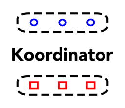
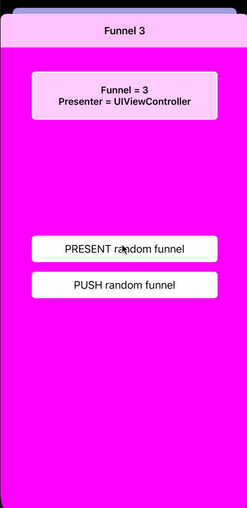

`Koordinator` is a simple and flexible implementation of the Coordinator pattern.

# Overview

The Coordinator pattern can be used to solve the problem of orchestrating the iOS navigation. <br/>
This framework standardizes the navigation entities behaviour. <br/><br/>
It also helps to manage the back button and the iOS 13 swipe down behaviour ([`isModalInPresentation`](https://developer.apple.com/documentation/uikit/uiviewcontroller/3229894-ismodalinpresentation)),<br/> so that a coordinator is automatically notified if its view controller gets dismiss/pop.



# Example

- Let's say we want to push a view controller into a navigation stack, just need to call the `start` function of the `BaseCoordinator`:


```
let myNavigation: UINavigationController!

...

let coordinator = DemoCoordinator(presenter: myNavigation)
coordinator.start()
```

The coordinator could be simply defined as a subclass of `BaseCoordinator`:

```
class DemoCoordinator: BaseCoordinator {
    override func start() {
        let someViewController = UIViewController()
        show(someViewController)
    }
}
```

- If, instead, we want to present modally a view controller, make sure the `Presenter` is a simple `UIViewController`:

```
let myNavigation: UINavigationController!

...

let coordinator = DemoCoordinator(presenter: myNavigation.visibleViewController)
coordinator.start()
```


# Framework

The framework offers the following protocols and helper classes:

1. `Koordinator`: it's the navigation orchestrator, can create children coordinators, can make/show view controllers, it essentially manages their life cycle.

```
protocol Koordinator {
    associatedtype Koordinator: Hashable

    var children: Set<Koordinator> { get set }
    var presenter: Presenter? { get set }

    func start()
    func start(child: Koordinator)
    func show(_ viewController: UIViewController)
}
```

2. `Presenter`: it's the entity that shows the view controller. <br/>If the presenter is a:
    - `UIViewController`: the view controller is presented
    - `UINavigationViewController`: the view controller is pushed
    - `UITabBarController`: the view controller is appended as a new tab
    - `UIWindow`: the view controller becomes the root

```
protocol Presenter: class {
    func show(_ viewController: UIViewController)
}
```

3. `BaseCoordinator: Koordinator`: plug and play implementation of the coordinator

4. `BaseViewController: UIViewController`: helps to manage pop/dismiss callbacks to the `BaseCoordinator`
